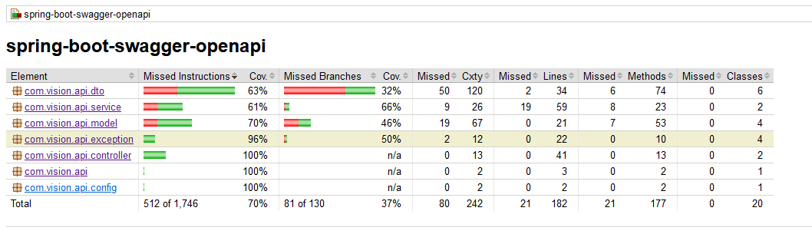

# Demo REST API CRUD with Swagger Open API
- Spring Boot, JPA, H2 DB and Swagger Open API 3

## Prerequisites
- Spring Boot (2.7)
- Maven 
- Java (11)
- Libraries:
  * starter-web 
  * starter-data-jpa
  * H2
  * lombok/logback
  * jCoCo
  * ModuleMapper
  * Spring Entity Validation 
  * Swagger Open API

### Testing
- First check that you are able to compile and pass the tests:
```
./gradlew test
```

- For test report and code coverage: 

```
open build/reports/tests/test/index.html

./gradlew build jacocoTestReport
open build/reports/jacoco/test/html/index.html
```

### Gradle Tool

- To run the backend API locally: 

```
./gradlew bootRun
```

- Otherwise, to build it as a fat jar and execute it:

```
./gradlew bootJar
java -jar build/libs/spring-boot-junit5-com.vision.api-1.0-SNAPSHOT.jar
```

## Maven Tool
```
mvn clean test
```

- For test report and code coverage: 
-

```
mvn surefire-report:report
open target/site/surefire-report.html

mvn jacoco:report
open target/site/jacoco/index.html
```

## Start

- To run the backend API locally: 

```
mvn spring-boot:run
```

- Otherwise, to build it as a fat jar and execute it:

```
mvn clean install 
java -jar target/spring-boot-junit5-1.0-SNAPSHOT.jar
```

# DB Server check

- To access to the database (H2) on dev mode:

```
open http://localhost:9095/h2-console 
```

# API Documentation (Swagger): 

```
open http://localhost:9095/v3/api-docs
open http://localhost:9095/swagger-ui.html
```

# Import Postman collection and Test.
- Postman collect Location: `\spring-boot-swagger-openapi\Spring2.7-JPA-CRUD-Author Rest API with Open Swagger.postman_collection.json`
